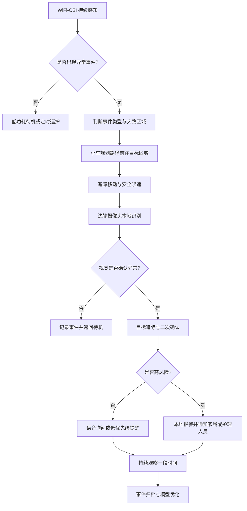
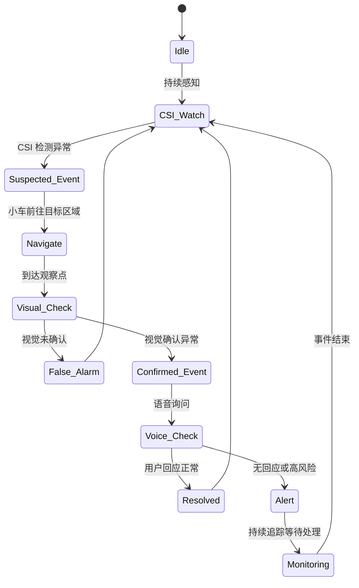
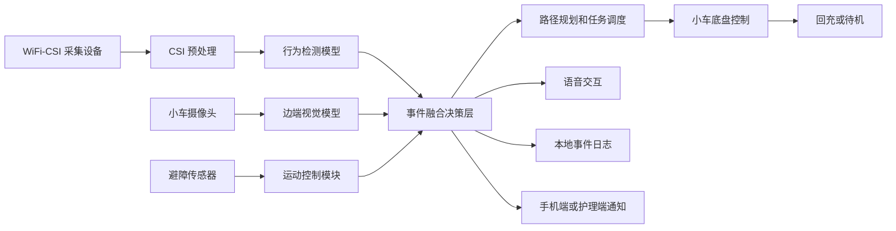

# WiFi-CSI、边端视觉识别与避障小车集成产品方案分析

## 1. 结论概述

本方案具有实行必要，但前提是不能将其定位为泛用型智能小车或多功能陪护机器人，而应聚焦为：

> 面向独居老人和养老机构的室内主动安全巡护系统。

该系统的核心价值是：

> 在不持续开启摄像头的情况下，通过 WiFi-CSI 无感发现异常，再由避障小车移动到现场，通过边端视觉识别确认风险，并完成语音询问、分级告警和事件记录。

从实用价值角度看，该方案不是简单地将 WiFi-CSI、图像识别和避障小车三项技术堆叠在一起，而是让三者分别承担不同角色：

- WiFi-CSI：负责无感、隐私友好的异常触发。
- 边端视觉识别：负责现场确认、姿态判断和目标追踪。
- 避障小车：负责移动到更合适的观察位置，并执行现场交互。
- 事件决策系统：负责融合判断、分级告警和闭环处置。

因此，方案的实用价值主要体现在：

- 比单纯摄像头更隐私友好。
- 比手环等穿戴设备更无感。
- 比固定雷达或固定传感器更能确认现场情况。
- 比普通巡逻机器人更有明确的事件触发逻辑。

优先推荐的应用场景是：

> 养老机构夜间跌倒与滞留巡护，其次是独居老人居家安全看护。

---

## 2. 推荐应用场景

### 2.1 场景名称

室内主动安全巡护小车。

### 2.2 目标用户

主要用户包括：

- 独居老人家庭
- 养老院
- 护理院
- 康复中心
- 社区照护机构

其中，最适合作为首个落地场景的是：

> 养老机构夜间巡护。

原因是养老机构具有更清晰的使用需求、更稳定的空间环境、更明确的告警接收方，也更容易进行试点和产品迭代。

### 2.3 典型问题

该产品主要解决以下问题：

- 老人跌倒后无法主动求助。
- 夜间起身、卫生间滞留等高风险行为难以及时发现。
- 固定摄像头存在隐私压力和视觉盲区。
- 手环、胸牌等穿戴设备依赖用户佩戴，容易忘戴、没电或被摘下。
- 护理人员无法全天候实时巡查每个房间。
- 普通传感器只能发现异常，难以确认现场情况。

### 2.4 产品一句话定义

> 当老人可能发生跌倒、长时间静止或夜间异常活动时，系统通过 WiFi-CSI 无感检测异常，并派小车避障前往现场，用本地视觉识别确认状态，必要时向护理人员或家属发出分级告警。

---

## 3. 系统角色分工

### 3.1 WiFi-CSI 检测模块

WiFi-CSI 适合承担前置感知任务。

主要能力：

- 人体存在检测
- 活动强度检测
- 起身、行走、静止判断
- 疑似跌倒检测
- 长时间静止检测
- 夜间离床检测
- 区域级活动感知
- 呼吸或微动状态辅助判断

不适合承担的任务：

- 精确识别身份
- 直接判断是否真实跌倒
- 判断老人是否受伤
- 复杂多人场景下的精确行为理解

因此，WiFi-CSI 在本方案中的定位是：

> 作为异常事件的前置触发器，而不是最终裁判。

示例输出：

```json
{
  "event_type": "suspected_fall",
  "confidence": 0.82,
  "zone": "living_room",
  "timestamp": "2026-05-09T22:31:08",
  "motion_intensity": "high_then_static"
}
```

### 3.2 边端视觉识别模块

边端视觉识别负责对 CSI 触发的异常事件进行现场确认。

主要能力：

- 人体检测
- 姿态估计
- 跌倒确认
- 目标追踪
- 障碍物识别
- 简单场景判断
- 本地事件推理

视觉识别的核心价值是：

> 将“传感器推测可能异常”转化为“现场图像确认是否异常”。

示例输出：

```json
{
  "person_detected": true,
  "posture": "lying_on_floor",
  "fall_confirmed": true,
  "tracking_id": 3,
  "confidence": 0.91,
  "privacy_mode": "local_only"
}
```

边端视觉第一阶段不建议做过多扩展功能，例如：

- 复杂人脸识别
- 情绪识别
- 行为意图识别
- 全天候视频云存储

第一阶段应聚焦：

- 是否有人
- 人在哪里
- 是站立、坐下还是躺倒
- 是否持续不动
- 是否需要人工介入

### 3.3 避障小车模块

小车的价值不是“会移动”本身，而是能够在异常发生后移动到更合适的位置进行确认和交互。

主要能力：

- 从充电桩自动出发
- 前往固定观察点
- 低速安全移动
- 避开家具、拖鞋、电线等障碍
- 防跌落和急停
- 摄像头角度调整
- 语音询问
- 声光提醒
- 任务完成后自动回充

小车适合的工作模式不是全屋自由巡航，而是：

> 在固定场景中，围绕几个预设观察点进行任务式移动。

例如：

- 充电桩
- 客厅观察点
- 卧室门口
- 卫生间门口
- 玄关
- 走廊中段

第一阶段不建议直接做完整全屋 SLAM 和复杂自主导航，而应优先保证固定点位移动的稳定性。

### 3.4 事件融合决策层

事件融合决策层是整个系统的核心。

它负责将 WiFi-CSI、视觉识别和小车状态统一起来，避免各模块独立判断导致误报或冲突。

决策层需要回答：

- CSI 是否触发异常？
- 异常发生在哪个区域？
- 小车是否需要前往？
- 小车能否安全到达？
- 视觉是否确认异常？
- 是否需要语音询问？
- 是否需要通知家属或护理人员？
- 是否需要持续追踪？
- 事件何时关闭？

---

## 4. 典型业务流程

### 4.1 跌倒事件流程

1. WiFi-CSI 检测到客厅或卧室出现剧烈姿态变化。
2. 随后检测到人体长时间静止。
3. 系统生成“疑似跌倒”事件。
4. 小车从充电桩出发，前往对应观察点。
5. 移动过程中通过避障模块绕开地面障碍。
6. 到达后开启边端摄像头进行本地识别。
7. 视觉模型检测到人体横卧地面，并持续数秒无明显移动。
8. 系统进入高风险状态。
9. 小车通过语音询问：“您还好吗？是否需要帮助？”
10. 若无回应，系统向护理站或家属推送告警。
11. 小车保持安全距离，持续追踪现场状态。
12. 事件处理完成后归档，并回到充电桩。

### 4.2 卫生间滞留流程

1. WiFi-CSI 检测到老人进入卫生间附近区域。
2. 超过设定时间仍未检测到离开。
3. 系统生成“卫生间滞留”事件。
4. 小车移动到卫生间门口。
5. 摄像头不主动拍摄卫生间内部，仅观察门口区域。
6. 小车进行语音询问。
7. 若无回应，则通知护理人员或家属。

### 4.3 夜间离床流程

1. WiFi-CSI 检测到老人夜间离床。
2. 系统判断是否属于正常活动。
3. 若老人长时间未返回，或走向高风险区域，小车前往附近观察点。
4. 视觉模块进行人体追踪和状态确认。
5. 若老人正常返回床边，则事件自动关闭。
6. 若出现跌倒、长时间静止或无回应，则升级告警。

---

## 5. 系统整体逻辑



---

## 6. 事件状态机



---

## 7. 分级告警机制

产品不能简单采用“有异常就报警”的逻辑，否则误报会严重影响用户信任。

建议采用分级告警机制：

| 等级 | 触发条件 | 系统动作 |
|---|---|---|
| Level 0 | 无异常 | 待机或低频巡护 |
| Level 1 | CSI 低置信异常 | 记录事件，继续观察 |
| Level 2 | CSI 高置信异常 | 小车前往现场确认 |
| Level 3 | 视觉确认异常 | 语音询问，并通知家属或护理人员 |
| Level 4 | 高危状态持续且无回应 | 强告警，升级通知 |

不同事件的处理方式：

| 事件 | CSI 触发 | 视觉确认 | 小车动作 | 告警策略 |
|---|---|---|---|---|
| 跌倒 | 高强度运动后静止 | 人体横卧地面 | 快速前往并安全停靠 | 高优先级告警 |
| 夜间离床 | 床区人体离开 | 人体在走廊或客厅 | 低速跟随或前往观察点 | 中低优先级提醒 |
| 卫生间滞留 | 长时间停留 | 门口状态确认 | 门外询问 | 超时后告警 |
| 长时间静止 | 微动减少 | 姿态识别 | 靠近观察 | 分级提醒 |
| 陌生人进入 | 异常活动轨迹 | 人体或身份确认 | 远距离观察 | 家属确认 |

---

## 8. 实用价值分析

### 8.1 真实需求是否存在

该方案解决的是真实需求，尤其是在老人看护场景中。

典型痛点包括：

- 老人跌倒后无法主动求助。
- 护理人员夜间巡查频率有限。
- 家属无法实时掌握老人状态。
- 摄像头长期监控带来隐私压力。
- 穿戴设备依赖佩戴，不稳定。
- 固定传感器无法移动确认现场。

因此，该方案具备明确的实用价值。

### 8.2 相比现有方案的增量价值

| 方案 | 优点 | 缺点 |
|---|---|---|
| 固定摄像头 | 画面直观，识别能力强 | 隐私争议大，有视觉盲区 |
| 手环或胸牌 | 成本较低，可检测摔倒 | 需要佩戴，容易忘戴或没电 |
| 床垫、门磁、红外 | 部署简单 | 信息碎片化，只能感知局部 |
| 固定雷达 | 隐私较好 | 无法移动确认，语义理解有限 |
| 人工巡查 | 判断准确 | 人力成本高，难以实时覆盖 |
| 普通巡逻机器人 | 可移动 | 如果没有事件触发，会变成低效巡航 |
| 本方案 | 无感触发、移动确认、边端识别、分级告警 | 成本和系统复杂度较高 |

本方案的主要优势是：

> 比摄像头更隐私友好，比手环更无感，比固定雷达更能确认现场，比普通机器人更有明确任务触发。

### 8.3 三个技术模块是否都有必要

#### WiFi-CSI 的必要性

WiFi-CSI 有必要，但不能承担最终判断。

它的必要性在于：

- 降低摄像头持续开启的需求。
- 提供全天候、无感、低打扰的异常触发。
- 能够在卧室、卫生间附近等隐私敏感区域进行非视觉感知。

#### 边端视觉识别的必要性

边端视觉识别非常必要。

它的必要性在于：

- 确认 CSI 触发的异常是否真实存在。
- 降低误报。
- 为家属和护理人员提供更可理解的事件依据。
- 支持目标追踪和现场状态判断。

#### 避障小车的必要性

小车的必要性取决于场景。

在以下情况下，小车有实际价值：

- 固定摄像头存在盲区。
- 用户不愿在每个房间部署摄像头。
- 需要移动到多个区域确认异常。
- 需要靠近目标进行语音询问或现场观察。
- 场地结构相对固定，小车能稳定移动。

如果只是单个小房间，固定摄像头或固定雷达已经能够覆盖，则小车的必要性会下降。

---

## 9. 产品化价值

### 9.1 核心价值主张

本产品不应被宣传为“智能机器人”或“万能看护设备”，而应强调：

> 平时不打扰、不持续拍摄；异常时主动靠近、确认、询问并告警。

核心卖点包括：

- 无感检测
- 隐私友好
- 事件触发式视觉确认
- 本地 AI 识别
- 移动式现场确认
- 分级告警
- 事件记录和可追溯

### 9.2 家庭版价值

适合独居老人家庭。

价值点：

- 家属远程了解老人安全状态。
- 老人不需要主动佩戴设备。
- 不需要在家里布满摄像头。
- 异常发生后能够自动确认和告警。

难点：

- 家庭环境复杂。
- 用户对价格较敏感。
- 设备安装和维护难度较高。
- 小车可能受家具、地毯、电线影响。
- 老人对小车接受度需要验证。

### 9.3 机构版价值

适合养老院、护理院和康复中心。

价值点：

- 夜间护工人手不足时提供补充巡护。
- 降低跌倒事件漏报风险。
- 支持护理站集中告警。
- 形成事件记录，便于管理和责任追溯。
- 场景更可控，路线更固定。
- 设备成本可以按床位或房间摊薄。

因此，机构版更适合作为首个试点方向。

---

## 10. 技术架构建议

### 10.1 系统架构



### 10.2 推荐通信方式

模块之间可采用：

- MQTT
- ROS2 Topic
- WebSocket
- 本地 HTTP API

### 10.3 推荐原型技术栈

| 模块 | 建议方案 |
|---|---|
| 小车控制 | ROS2 或 Python 控制服务 |
| 边端视觉 | YOLO、姿态估计模型、OpenCV |
| CSI 检测 | Python 推理服务 |
| 调度层 | Python FastAPI 或 Node.js |
| 告警端 | Web 控制台优先，后续再做 App |
| 通信 | MQTT 或 WebSocket |

### 10.4 硬件建议

低成本原型版：

| 模块 | 建议 |
|---|---|
| CSI 采集 | 支持 CSI 的 WiFi 网卡、路由器或专用采集节点 |
| 主控 | Raspberry Pi 5、RK3588、Jetson Nano 或 Jetson Orin Nano |
| 视觉 | USB 摄像头或 RGB-D 摄像头 |
| 底盘 | 双轮差速底盘 |
| 避障 | 超声波、ToF、防跌落传感器 |
| 通信 | MQTT、ROS2 或 WebSocket |
| 交互 | 麦克风、扬声器、状态灯 |

产品化版本：

| 模块 | 建议 |
|---|---|
| CSI | 专用 WiFi sensing 节点 |
| 视觉 | 带隐私遮挡结构的广角摄像头和红外补光 |
| 边缘计算 | RK3588、Jetson Orin Nano 或其他 NPU 模组 |
| 避障 | 深度摄像头、2D LiDAR、ToF |
| 底盘 | 低速、静音、防缠绕底盘 |
| 安全 | 急停、防跌落、碰撞缓冲 |
| 软件 | 本地事件引擎和云端通知服务 |

---

## 11. MVP 建议

### 11.1 MVP 定位

第一版建议聚焦为：

> 养老机构夜间跌倒确认小车。

不要做大而全的家庭机器人，而应验证一条完整闭环：

```text
CSI 发现异常
-> 小车前往固定观察点
-> 避障停靠
-> 边端视觉确认
-> 语音询问
-> 护理端告警
-> 事件记录
-> 小车回充
```

### 11.2 MVP 必备功能

- WiFi-CSI 检测人体活动状态
- 识别疑似跌倒和长时间静止
- 小车在 3 到 5 个固定点位之间移动
- 基础避障和急停
- 摄像头本地检测人体姿态
- 简单语音播报
- 护理端或 Web 控制台接收告警
- 事件日志记录
- 小车任务完成后回充

### 11.3 MVP 不建议做的功能

- 高精度全屋定位
- 完整全屋 SLAM
- 多人复杂身份识别
- 人脸识别强绑定
- 全天候视频云存储
- 复杂陪聊
- 机械臂辅助
- 医疗诊断
- 多楼层调度

### 11.4 MVP 验收指标

| 指标 | 建议目标 |
|---|---|
| 疑似跌倒触发响应时间 | 10 秒内生成事件 |
| 小车到达观察点时间 | 30 到 90 秒，视距离而定 |
| 视觉确认时间 | 5 秒内 |
| 有效告警准确率 | 初期目标 85% 以上 |
| 严重误报频率 | 每晚不超过 1 次 |
| 小车卡住率 | 每 20 次任务小于 1 次 |
| 本地识别延迟 | 1 秒以内 |
| 摄像头默认关闭比例 | 非事件时间保持关闭 |

---

## 12. 风险分析与应对

### 12.1 WiFi-CSI 泛化风险

风险表现：

- 家具变化影响信号。
- 多人活动造成误判。
- 宠物、门窗、风扇等造成干扰。
- 不同房间和户型差异较大。
- WiFi 设备位置变化影响模型稳定性。

应对方式：

- CSI 只作为前置触发，不作为最终报警依据。
- 每个房间进行短期校准。
- 阈值根据环境自适应调整。
- 融合时间段和区域语义。
- 使用视觉确认结果反向优化 CSI 判断。

### 12.2 小车可靠性风险

风险表现：

- 被拖鞋、电线、地毯、家具腿阻挡。
- 狭窄通道无法通行。
- 夜间光线不足导致避障不稳定。
- 门槛或台阶导致卡住或跌落。

应对方式：

- 限定活动区域。
- 使用固定观察点导航。
- 低速移动。
- 遇障暂停并通知。
- 加入防跌落和急停机制。
- 优先验证固定路线稳定性。

### 12.3 误报和漏报风险

风险表现：

- 误报过多导致用户不再信任系统。
- 漏报高风险事件导致产品责任风险。

应对方式：

- 建立分级告警机制。
- CSI、视觉、语音回应共同决策。
- 不直接将单一模型输出作为最终报警。
- 建立事件复核和人工反馈机制。

### 12.4 隐私风险

风险表现：

- 用户将小车理解为移动摄像头。
- 卧室、卫生间等场景存在隐私顾虑。
- 远程查看和视频上传容易引发接受度问题。

应对方式：

- 摄像头默认关闭，仅在事件触发后开启。
- 图像识别尽量在本地完成。
- 默认不上传完整视频。
- 只上传事件摘要和必要关键帧。
- 卫生间和卧室设置隐私区域。
- 用户可查看摄像头开启记录。

### 12.5 商业落地风险

风险表现：

- 家庭用户价格敏感。
- 安装维护成本高。
- 售后复杂。
- 养老机构采购周期长。

应对方式：

- 先做机构试点。
- 控制功能边界。
- 以固定场景验证价值。
- 用事件记录、责任追溯、降低夜间巡护压力作为机构购买理由。

---

## 13. 是否值得实行

### 13.1 值得实行的条件

如果满足以下条件，该方案值得推进：

- 目标场景是老人看护、养老机构巡护或康复中心安全监测。
- 主要事件是跌倒、长时间静止、夜间离床、卫生间滞留。
- 用户不接受长期摄像头监控。
- 固定传感器存在盲区。
- 小车可以在相对固定的路线和观察点之间移动。
- 视觉识别能够本地运行。
- 系统可以做到分级告警。
- 能够收集真实场景数据持续优化。

### 13.2 不值得实行的情况

如果出现以下情况，不建议推进完整方案：

- 目标空间很小，固定传感器已经足够覆盖。
- 用户价格接受度极低。
- 环境极其复杂，小车无法稳定移动。
- 无法解决摄像头隐私问题。
- WiFi-CSI 误报无法控制。
- 项目目标只是技术展示，而没有明确用户和处置闭环。

### 13.3 综合判断

| 维度 | 评分 | 说明 |
|---|---:|---|
| 需求真实性 | 8/10 | 老人看护和跌倒确认是真痛点 |
| 技术互补性 | 8/10 | CSI、视觉和小车分工合理 |
| 产品差异化 | 7/10 | 相比摄像头、手环和雷达有明显不同 |
| 落地难度 | 7/10 | 主要难在 CSI 泛化和小车可靠性 |
| 成本压力 | 6/10 | 家庭版压力较大，机构版更可行 |
| 隐私风险 | 6/10 | 可通过事件触发和本地识别缓解 |
| 商业可行性 | 7/10 | 机构版优于家庭版 |
| MVP 可验证性 | 8/10 | 可以做出清晰 demo 和试点闭环 |

最终判断：

> 该方案具有较高实用价值和实行必要，但必须聚焦在异常事件主动确认，而不是泛用型智能机器人。

---

## 14. 推荐推进路径

### 14.1 第一阶段：验证 CSI 触发能力

目标：

- 判断 CSI 是否能稳定区分正常活动和异常活动。

重点验证：

- 正常行走
- 坐下
- 躺下
- 模拟跌倒
- 长时间静止
- 夜间离床

关键问题：

> CSI 是否能在真实环境中稳定生成“值得小车前往确认”的事件？

### 14.2 第二阶段：验证视觉确认能力

目标：

- 判断视觉识别是否能有效过滤 CSI 误报。

重点验证：

- 人体横卧地面识别
- 坐在沙发上不误报
- 弯腰拾物不误报
- 宠物经过不误报
- 长时间不动识别

关键问题：

> 视觉确认是否能显著降低误报，并提供可理解的现场依据？

### 14.3 第三阶段：验证小车固定点位移动

目标：

- 判断小车是否能稳定到达几个关键观察点。

重点验证：

- 充电桩到客厅观察点
- 充电桩到卧室门口
- 充电桩到卫生间门口
- 遇障停止或绕行
- 任务完成后自动回充

关键问题：

> 小车是否能在真实室内环境中可靠完成任务式移动？

### 14.4 第四阶段：验证完整闭环

目标：

- 让系统完成从异常检测到告警归档的完整流程。

完整闭环：

```text
异常感知
-> 事件触发
-> 小车前往
-> 避障靠近
-> 视觉确认
-> 语音询问
-> 分级告警
-> 持续追踪
-> 事件归档
```

关键问题：

> 家属或护理人员是否认为该系统真的减少了风险和巡护压力？

---

## 15. 最终建议

该项目建议继续推进，但应遵循以下原则：

1. 不做泛用机器人，聚焦老人安全看护。
2. 不做全天候摄像头监控，采用 CSI 触发式视觉确认。
3. 不做复杂自由导航，先做固定观察点移动。
4. 不承诺医疗诊断，只定位为安全提醒和异常确认。
5. 不追求功能大全，优先完成跌倒、长时间静止、夜间离床和卫生间滞留四类事件。
6. 不直接面向复杂家庭大规模推广，优先做养老机构试点。

推荐的第一版产品定位是：

> 养老机构夜间跌倒与滞留巡护小车。

推荐的第一版产品闭环是：

```text
WiFi-CSI 无感发现异常
-> 避障小车前往目标区域
-> 边端视觉本地确认
-> 小车语音询问
-> 护理端或家属端分级告警
-> 事件记录和追溯
```

如果这一闭环能在真实环境中稳定运行，该方案就具备进一步产品化和商业试点的基础。
