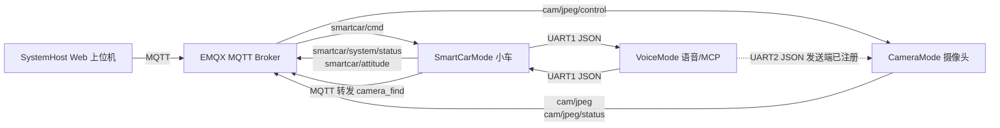
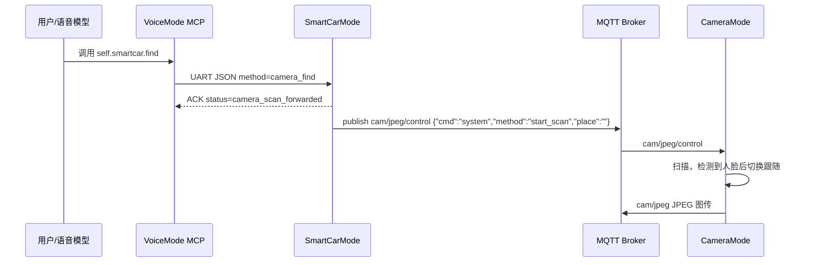

# 当前系统 MQTT 与串口通信协议设计

本文基于当前源码整理，覆盖 Web 上位机、SmartCar、小车运动控制、Camera 图传/扫描跟随、Voice MCP 串口网关之间的通信协议。

## 1. 系统通信拓扑



当前闭环主链路：

1. Web 上位机通过 MQTT 控制小车、摄像头。
2. Voice 通过 MCP 工具调用串口控制 SmartCar。
3. Voice 的“寻找”工具走 `Voice -> UART -> SmartCar -> MQTT -> Camera`，由小车转发摄像头 `start_scan`。
4. Camera 通过 MQTT 接收扫描/静默/关闭/恢复命令，并通过 MQTT 发布 JPEG 图传。

说明：Voice 侧已注册 `self.camera.scan`、`self.camera.scan_and_track_face` 的 UART 发送工具，但当前 CameraMode 源码中未看到对应 UART JSON 接收处理；当前可闭环执行的 Camera 控制链路是 MQTT `cam/jpeg/control`。

## 2. MQTT 基础配置

| 项目 | 当前设计 |
| --- | --- |
| Broker | `mqtts://x3a5a71f.ala.cn-hangzhou.emqxsl.cn:8883` |
| 传输 | MQTT over TLS |
| QoS 建议 | 控制命令 QoS 1；图传 QoS 0；状态 QoS 1 或 0 |
| Retain 建议 | `smartcar/system/status`、`cam/jpeg/status` 可 retain；控制命令不 retain |
| CA | SmartCar 使用 `tls_emqxsl_ca.c`；SystemHost 优先读取 SmartCar/Camera 的 CA 文件；Camera 可嵌入 `main/mqtt_ca.pem` |
| 账号 | SystemHost/Camera 默认使用 `spic`；SmartCar 默认使用 `car`；密码见各模块配置文件 |

## 3. MQTT 主题总表

| Topic | 方向 | Payload | 作用 |
| --- | --- | --- | --- |
| `smartcar/cmd` | 上位机/第三方 -> SmartCar | JSON 或兼容文本 | 系统状态机、小车遥控、长停/恢复 |
| `smartcar/system/status` | SmartCar -> 上位机 | JSON | 系统状态机状态上报 |
| `smartcar/attitude` | SmartCar -> 上位机 | JSON | 姿态/遥测数据 |
| `cam/jpeg/control` | 上位机/SmartCar -> Camera | JSON 或包含关键词的文本 | 摄像头模式、扫描跟随、静默/关闭/恢复 |
| `cam/jpeg/status` | Camera -> 上位机 | JSON retained | 摄像头运行模式提示 |
| `cam/jpeg` | Camera -> 上位机 | 二进制 JPEG | 远程图传帧 |

## 4. SmartCar MQTT 控制协议

### 4.1 系统状态机命令

发布到：

```text
smartcar/cmd
```

标准 JSON：

```json
{
  "cmd": "system",
  "state": "abnormal",
  "place": "bathroom",
  "requestId": "sys_1720000000000"
}
```

| 字段 | 类型 | 取值 | 说明 |
| --- | --- | --- | --- |
| `cmd` | string | `system` | 表示系统状态机命令 |
| `state` | string | `cruise` / `abnormal` / `return_home` | 目标系统状态 |
| `place` | string | `bedroom` / `bathroom` / `kitchen` / 空 | 异常地点，仅 `abnormal` 必填 |
| `requestId` | string | 自定义 | 上位机追踪请求 |

示例：

```json
{"cmd":"system","state":"cruise","place":"","requestId":"sys_001"}
{"cmd":"system","state":"abnormal","place":"bathroom","requestId":"sys_002"}
{"cmd":"system","state":"return_home","place":"","requestId":"sys_003"}
```

系统状态行为：

| state | SmartCar 行为 |
| --- | --- |
| `cruise` | 恢复巡航，通知 Voice `system_normal`，通知 Camera `normal` |
| `abnormal` | 进入异常路线，先静默 Voice/Camera，到达后通知 Voice 询问并通知 Camera `start_scan` |
| `return_home` | 执行返航路线，通知 Voice/Camera 关闭操作，返航完成后恢复正常 |

### 4.2 小车短时遥控

推荐 JSON：

```json
{
  "data": {
    "drive": "forward"
  },
  "requestId": "drv_1720000000000"
}
```

| `data.drive` | 行为 |
| --- | --- |
| `forward` | 短时前进，当前固件约 0.9s，可重复发送续时 |
| `backward` | 后退 |
| `left` | 短时左转 |
| `right` | 短时右转 |
| `stop` | 停止当前短时遥控，不进入长停 |

兼容字段：`drive`、`move`、`motion`、`steer`、`cmd` 中的 `forward/backward/back/reverse/left/right/stop` 也会被解析。

### 4.3 小车全停与恢复

全停命令：

```json
{"requestId":"nav_002","data":{"action":"stop"}}
```

恢复运动命令：

```json
{"requestId":"nav_004","data":{"action":"run"}}
```

语义区别：

| 命令 | 作用 |
| --- | --- |
| `data.drive=stop` | 只停止当前短时遥控动作 |
| `data.action=stop` | 长停：电机停止，避障/自动导航挂起 |
| `data.action=run` | 解除长停，恢复避障/自动行驶，并复位避障舵机到中心角 |

当前固件还兼容：

```json
{"data":{"nav":"pause"}}
{"data":{"nav":"resume"}}
{"data":{"switch":"off"}}
{"data":{"switch":"on"}}
{"cmd":"pause"}
{"cmd":"resume"}
{"run":false}
{"run":true}
```

## 5. SmartCar MQTT 上报协议

### 5.1 系统状态上报

Topic：

```text
smartcar/system/status
```

Payload：

```json
{
  "state": "abnormal_running",
  "place": "bathroom",
  "phase": "begin",
  "ts": 12345678
}
```

| 字段 | 类型 | 取值/说明 |
| --- | --- | --- |
| `state` | string | `cruise` / `abnormal_running` / `abnormal_ready` / `return_running` |
| `place` | string | `bedroom` / `bathroom` / `kitchen` / 空 |
| `phase` | string | `entered` / `begin` / `moving` / `arrived` 等 |
| `ts` | number | SmartCar 启动后的毫秒时间 |

### 5.2 姿态上报

Topic：

```text
smartcar/attitude
```

Payload 示例：

```json
{
  "r": 0.1,
  "p": -1.2,
  "y": 25.6,
  "mag": 0,
  "ts": 12345678
}
```

| 字段 | 说明 |
| --- | --- |
| `r` | roll，横滚角 |
| `p` | pitch，俯仰角 |
| `y` | yaw，航向角 |
| `mag` | 是否有磁力计数据 |
| `ts` | 时间戳 |

## 6. Camera MQTT 控制与图传协议

### 6.1 控制主题

Topic：

```text
cam/jpeg/control
```

标准 JSON：

```json
{
  "cmd": "system",
  "method": "start_scan",
  "place": "bathroom"
}
```

| `method` | Camera 行为 |
| --- | --- |
| `start_scan` | 切换到 MQTT 图传，开始水平扫描；检测到人脸后退出扫描，进入人脸跟随 |
| `silent` | 静默，停止 JPEG 发布与跟随 |
| `off` | 关闭摄像头联动操作，停止图传与跟随 |
| `normal` | 恢复正常，允许 JPEG 发布 |
| `lcd` / `local` | 运行时切换本地 LCD 显示 |
| `mqtt` / `remote` | 运行时切换远程 MQTT 图传 |

Camera 当前解析方式是关键词匹配，以下文本也会触发扫描：

```text
start_scan
scan_and_track
start_action
inquiry
开始
扫描
```

扫描跟随状态说明：

1. 收到 `start_scan` 后重置扫描状态和跟踪目标。
2. 竖直方向先在中等高度扫描。
3. 未检测到人脸则抬高约 30 度扫描。
4. 仍未检测到则基于初始角降低约 30 度，即相对上一阶段降低约 60 度后扫描。
5. 一旦检测到人脸，Camera 从扫描状态切换到跟随状态。
6. 除非再次收到 `start_scan`，否则检测到人脸后不再自动回到扫描。

### 6.2 状态主题

Topic：

```text
cam/jpeg/status
```

Payload：

```json
{"mode":"mqtt"}
```

| `mode` | 说明 |
| --- | --- |
| `mqtt` | Camera 当前处于远程 MQTT 图传模式 |
| `lcd` | Camera 当前处于本地 LCD 显示模式 |

### 6.3 JPEG 图传主题

Topic：

```text
cam/jpeg
```

Payload 为二进制 JPEG 数据，接收端应按二进制处理，不要当作 UTF-8 文本解析。SystemHost 将该主题转换为 `/video.mjpg` 供浏览器显示。

## 7. Voice 与 SmartCar 串口协议

### 7.1 物理层

| 项目 | VoiceMode | SmartCarMode |
| --- | --- | --- |
| UART | UART1 | UART1 |
| 波特率 | 115200 | 115200 |
| 数据格式 | 8N1，无流控 | 8N1，无流控 |
| Voice TX | GPIO11 | 接 SmartCar RX GPIO18 |
| Voice RX | GPIO8 | 接 SmartCar TX GPIO21 |
| 帧边界 | `\n` 换行分隔 JSON | `\n` 换行分隔 JSON |

注意：`board_pins.h` 的旧注释中提到 Voice UART1 TX/RX 为 GPIO17/GPIO16，但当前 `VoiceMode/main/boards/bread-compact-wifi/config.h` 实际配置是 TX GPIO11、RX GPIO8，应以当前配置文件为准。

### 7.2 Voice -> SmartCar 命令帧

统一 JSON 行格式：

```json
{
  "v": 1,
  "id": "smartcar_move_forward_1",
  "target": "smartcar",
  "method": "move_forward",
  "params": {
    "speed": 40,
    "duration_ms": 600
  }
}
```

| 字段 | 必填 | 说明 |
| --- | --- | --- |
| `v` | 否 | 协议版本；当前为 `1`，非 1 会拒绝 |
| `id` / `request_id` | 否 | 请求 ID，ACK 会回传 |
| `target` | 否 | 若存在必须为 `smartcar` |
| `method` | 是 | 方法名 |
| `params` | 否 | 方法参数对象 |

SmartCar 支持的方法：

| method | alias | params | 行为 |
| --- | --- | --- | --- |
| `move_forward` | `forward` | `speed`、`duration_ms` | 前进 |
| `move_backward` | `backward` | `speed`、`duration_ms` | 后退 |
| `turn_left` | `left` | `speed`、`duration_ms` | 左转 |
| `turn_right` | `right` | `speed`、`duration_ms` | 右转 |
| `stop` | `action_stop` | 无 | 小车长停，暂停避障 |
| `return_home` | 无 | 无 | 按串口运动历史返航 |
| `camera_find` | `find` | 无 | 通过 MQTT 向 Camera 转发 `start_scan` |
| `resume_nav` | 无 | 无 | 恢复导航 |

参数默认值：

| 方法 | 默认 speed | 默认 duration_ms |
| --- | --- | --- |
| `move_forward` | 40 | 600 |
| `move_backward` | 35 | 500 |
| `turn_left` | 35 | 250 |
| `turn_right` | 35 | 250 |

参数约束：

| 参数 | 范围 |
| --- | --- |
| `speed` | 0..100 |
| `duration_ms` | 50..10000 |

### 7.3 SmartCar -> Voice ACK

ACK 格式：

```json
{
  "v": 1,
  "ok": true,
  "target": "smartcar",
  "method": "move_forward",
  "request_id": "smartcar_move_forward_1",
  "id": "smartcar_move_forward_1",
  "status": "accepted"
}
```

错误示例：

```json
{
  "v": 1,
  "ok": false,
  "target": "smartcar",
  "method": "unknown",
  "request_id": "smartcar_unknown_1",
  "id": "smartcar_unknown_1",
  "status": "rejected",
  "error": "unsupported_method"
}
```

常见 `status`：

| status | 说明 |
| --- | --- |
| `accepted` | 命令已接受 |
| `stopped` | 停车命令已执行 |
| `camera_scan_forwarded` | `camera_find` 已转发到 MQTT |
| `empty_history` | 返航历史为空 |
| `rejected` | 命令被拒绝，查看 `error` |

常见 `error`：

| error | 原因 |
| --- | --- |
| `invalid_json` | 串口行不是合法 JSON |
| `unsupported_version` | `v` 不是当前支持版本 |
| `wrong_target` | `target` 不是 `smartcar` |
| `missing_method` | 缺少 `method` |
| `line_too_long` | 单行超过接收缓存 |
| `unsupported_method` | 方法不支持 |

### 7.4 SmartCar -> Voice 系统联动帧

SmartCar 在系统状态机中会主动通知 Voice：

```json
{
  "v": 1,
  "target": "voice",
  "method": "system_inquiry",
  "id": "system_inquiry",
  "params": {
    "place": "bathroom"
  }
}
```

| method | Voice 行为 |
| --- | --- |
| `system_silent` / `silent` | 进入系统静默 |
| `system_inquiry` / `start_action` / `inquiry` | 开始系统询问 |
| `system_off` / `off` | 关闭/停止操作，保持静默 |
| `system_normal` / `normal` / `resume` | 退出系统静默 |

## 8. Voice MCP 工具到串口方法映射

VoiceMode 的 `DownstreamUartGateway` 当前注册以下工具：

| MCP 工具 | 串口 target | 串口 method | 说明 |
| --- | --- | --- | --- |
| `self.smartcar.forward` | `smartcar` | `move_forward` | 小车前进 |
| `self.smartcar.backward` | `smartcar` | `move_backward` | 小车后退 |
| `self.smartcar.turn_left` | `smartcar` | `turn_left` | 小车左转 |
| `self.smartcar.turn_right` | `smartcar` | `turn_right` | 小车右转 |
| `self.smartcar.stop` | `smartcar` | `stop` | 小车长停 |
| `self.smartcar.return_home` | `smartcar` | `return_home` | 根据串口历史返航 |
| `self.smartcar.find` | `smartcar` | `camera_find` | “寻找”：小车通过 MQTT 转发 Camera `start_scan` |
| `self.camera.scan` | `camera` | `scan` | Camera UART 发送端工具，当前未确认 Camera 侧闭环接收 |
| `self.camera.scan_and_track_face` | `camera` | `scan_and_track_face` | Camera UART 发送端工具，当前未确认 Camera 侧闭环接收 |

“寻找”完整链路：



## 9. Web 上位机 API 到 MQTT 映射

SystemHost 是 Flask 单文件 Web 控制台，对外 HTTP API 最终转 MQTT：

| HTTP API | MQTT Topic | MQTT Payload |
| --- | --- | --- |
| `POST /api/system` | `smartcar/cmd` | `{"cmd":"system","state":"...","place":"...","requestId":"sys_..."}` |
| `POST /api/drive` | `smartcar/cmd` | `{"data":{"drive":"forward|backward|left|right|stop"},"requestId":"drv_..."}` |
| `POST /api/car/all-stop` | `smartcar/cmd` | `{"requestId":"nav_002","data":{"action":"stop"}}` |
| `POST /api/car/resume` | `smartcar/cmd` | `{"requestId":"nav_004","data":{"action":"run"}}` |
| `POST /api/camera` `method=lcd/local` | `cam/jpeg/control` | `{"mode":"lcd"}` |
| `POST /api/camera` `method=mqtt/remote` | `cam/jpeg/control` | `{"mode":"mqtt"}` |
| `POST /api/camera` 其他 method | `cam/jpeg/control` | `{"cmd":"system","method":"normal|silent|start_scan|off"}` |

Web 上位机订阅：

| Topic | 用途 |
| --- | --- |
| `smartcar/attitude` | 显示小车姿态/遥测 |
| `smartcar/system/status` | 刷新系统状态机 |
| `cam/jpeg` | 转为 `/video.mjpg` |
| `cam/jpeg/status` | 显示摄像头模式 |

## 10. 关键设计约束

1. `smartcar/cmd` 是小车控制入口，不要把小车控制命令发到 `smartcar/attitude`。
2. `cam/jpeg` 是二进制 JPEG，不要作为文本解析。
3. `data.drive=stop` 与 `data.action=stop` 语义不同：前者是短停，后者是长停。
4. `data.action=run` 恢复长停后，当前固件会复位避障舵机到中心角并重新进入前方避障扫描。
5. Camera 扫描跟随的当前主入口是 MQTT `cam/jpeg/control` 的 `start_scan`。
6. Voice 到 SmartCar 的串口协议以换行 JSON 为帧边界，必须保证每条 JSON 一行。
7. 串口 target 字段可省略；若存在则必须匹配接收端，例如 SmartCar 只接受 `target=smartcar`。
8. 控制命令建议 QoS 1 且不 retain，避免设备重连后重复执行历史命令。

